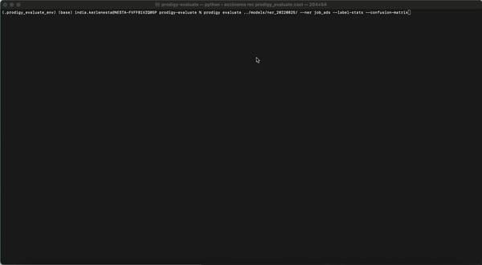

<a href="https://explosion.ai"></a>

# 🔎 Prodigy-evaluate

This repository contains a Prodigy plugin for recipes to evaluate spaCy pipelines. It features two recipes:

1. `evaluate`: This recipe evaluates a spaCy pipeline on a dataset of annotated examples. 
2. `evaluate-example`:  

It computes a variety of evaluation metrics, including precision, recall, F1, accuracy, and more. It also supports evaluation of named entities, part-of-speech tags, and dependency labels.

Here's a preview of the `evaluate` recipe in the terminal:

<p align="center">
  
</p>


Here's a preview of the `evaluate-example` recipe in the terminal:

<p align="center">
  
</p>


You can install this plugin via `pip`. 

```
pip install "prodigy-evaluate @ git+https://github.com/explosion/prodigy-evaluate.git@2_setup"
```

To learn more about this plugin, you can check the [Prodigy docs](https://prodi.gy/docs/plugins/#evaluate).

## Issues? 

Are you have trouble with this plugin? Let us know on our [support forum](https://support.prodi.gy/) and we'll get back to you! 